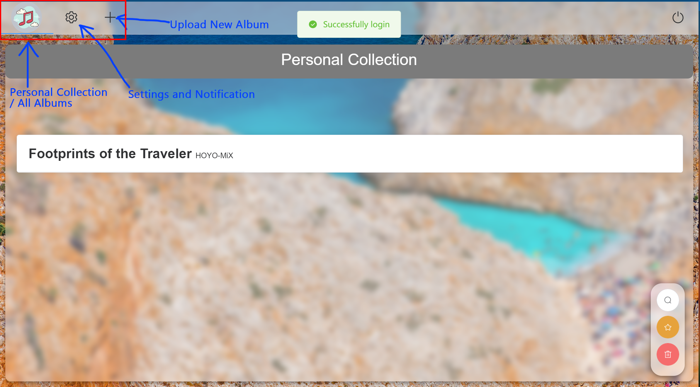
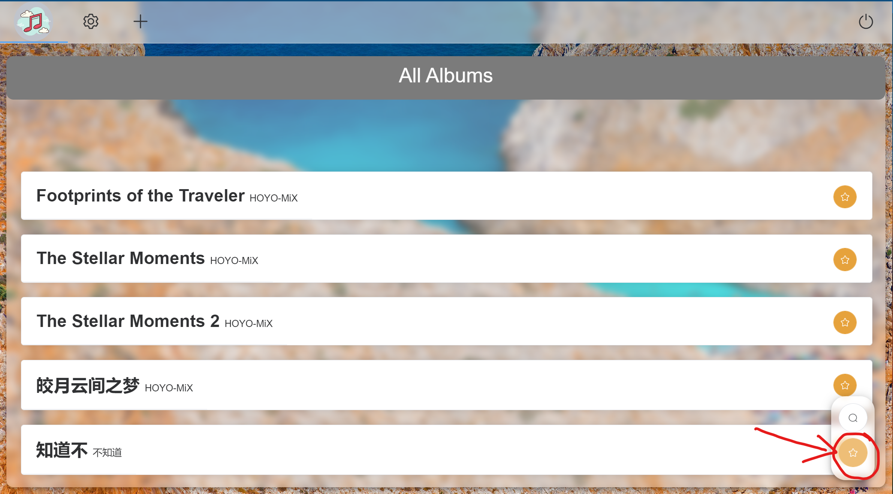
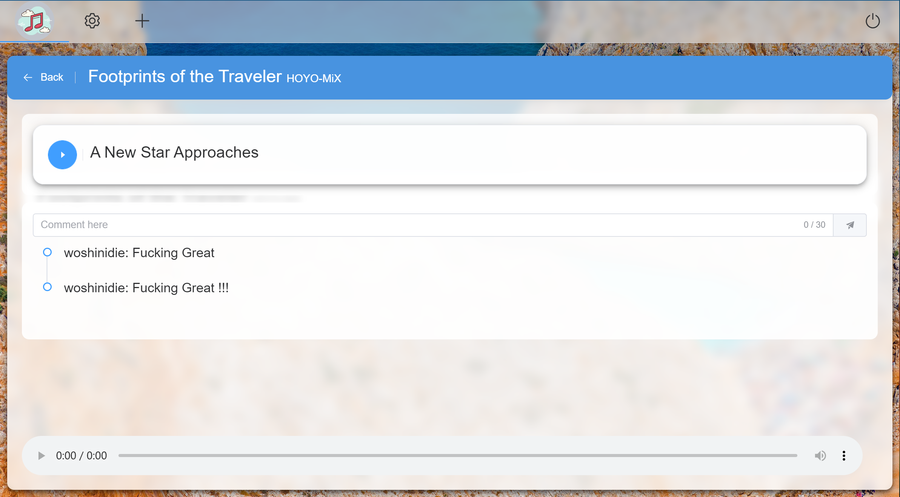
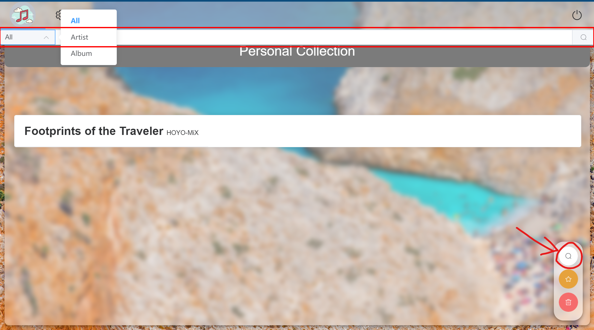
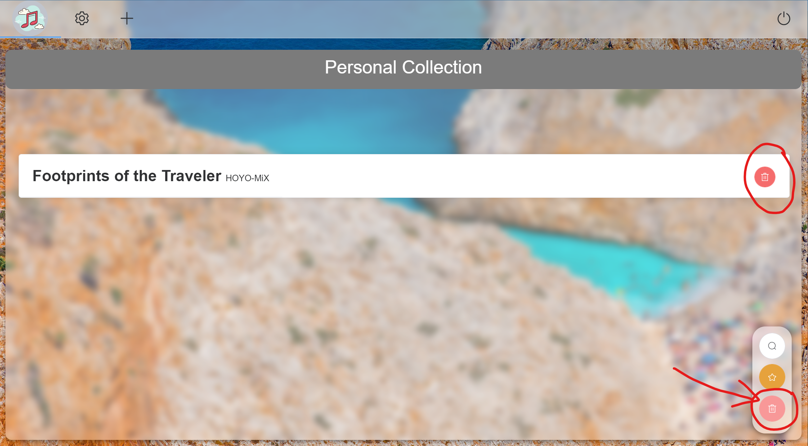
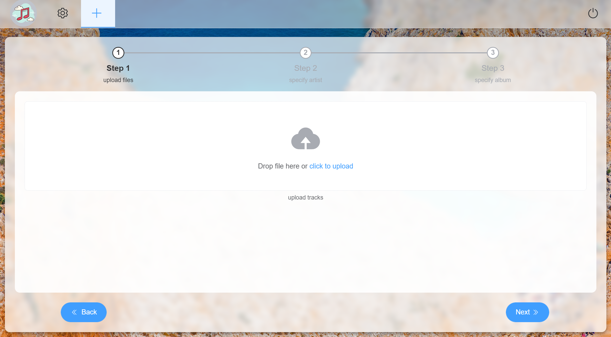
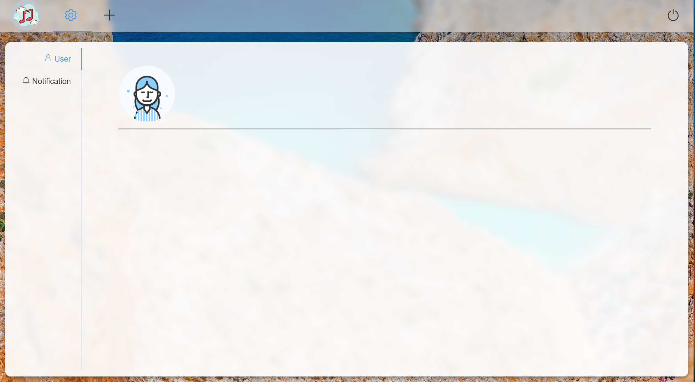
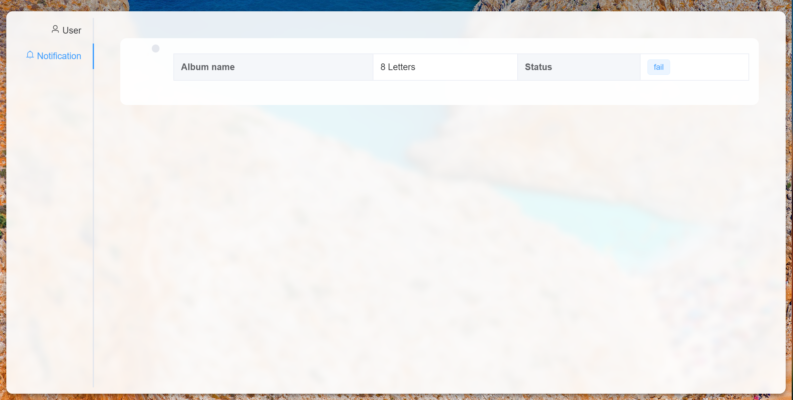
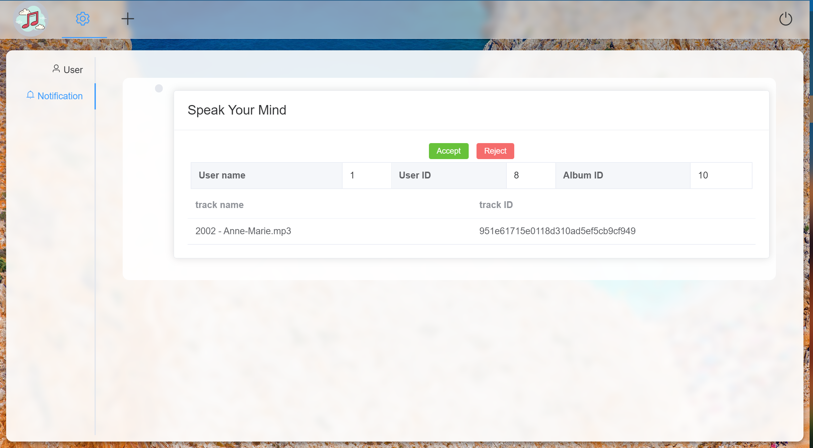
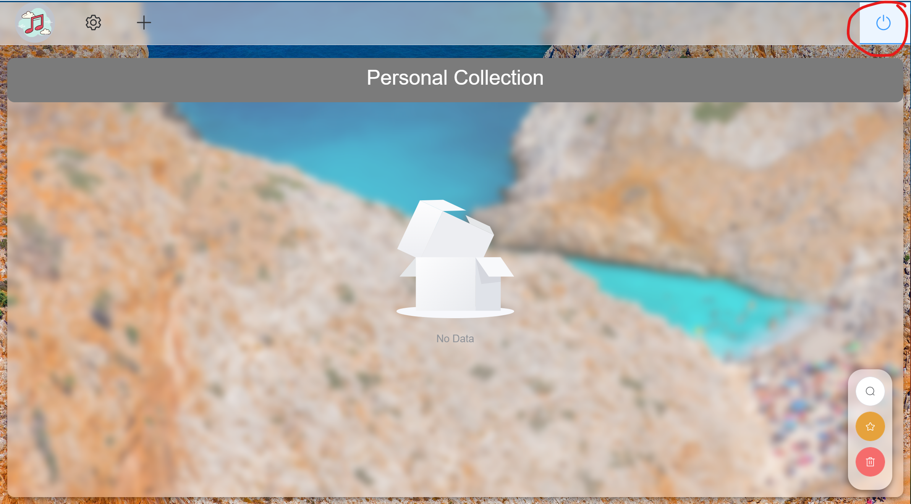

# Program Manual

[toc]

## 1. Login

After the program starts up:

!!! note
    The background image is loaded from Internet. If you encounter the problem of missing background, check if you've got an Internet connection.

## 2. Register

Click on the <button>Sign up</button> button in the Login window:

Click <button>Cancel</button> to return to the Login window. 

## 3. After Login

Enter the correct user name and password to login.

There're three tabs in general:

- **Personal Collection and All Albums**
- **Settings and Notifications**
- **Upload New Album**

Clicking on each tab button will be lead to its interface.

### 3.1. Personal Collection and All Albums 

By default, it shows *"Personal Collection"*. To switch between *"All Albums"* and *"Personal Collection"*, press the yellow button at bottom right:

#### 3.1.1. Album Detail

In both cases, when clicking on the album, it will show the album's detail, including:
- **tracks**

    Each track has a blue ==play button== at its left.
- **comments**

    You can send your comment about the album here, and see comments from other users
- **audio controller**

    You can control the music volumn, progress, start/pause, play back speed here

#### 3.1.2. Search

To search for an artist/album in both personal collection or all albums, press on the ==grey search botton== at bottom right corner, then the search bar will pop up on top:

#### 3.1.3. Remove Album

To remove album from *"Personal Collection"*, click on the ==red delete button== at bottom right corner, then each album will show an delete button:

Only administrator can remove album from *"All Albums"*.

### 3.2. Upload New Album

Three step's instruction can be seen in this tab:

- **upload files**

    upload the tracks in the same album you want to upload
- **specify artist**

    enter artist's name of the album
- **specify album**

    enter album's name

Use <button>Back</button> and <button>Next</button> to navigate between three steps

Common users' uploaded albums need to be reviewed by administrator in order to be formally added to the database's *"All Albums"*, while administrator itself need not.

### 3.3. Settings and Notifications

There're two sub tabs:
- **User**

    If the login user is administrator, its name will be shown here

    

- **Notification**

    Different users will see different kind of notification here
    - **Common Users**

        For common users, they can check the status of the albums they have tried to uploaded, whether they are ==accepted or rejected== by the administrator:

        

    - **Administrator**

        If there's an new upload request from common users, administrator can choose whether to accept/reject the request here:

        

### 3.4. Logout

To logout from current user, simply press the logout button at top right:

